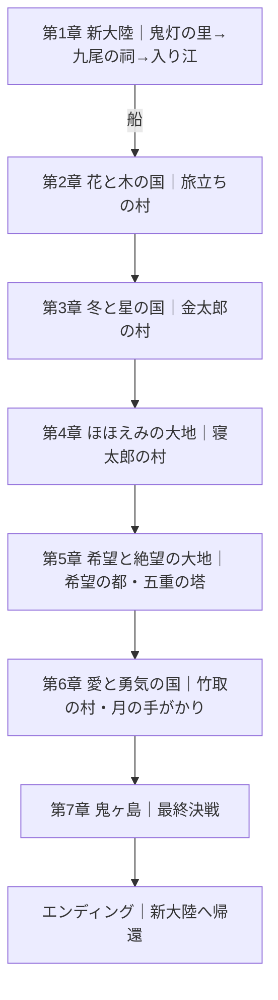

# 世界地図・章進行設計 v0.3（地形実装前仕様）

更新日: 2026-10-09

## 方針
- 原作『新・桃太郎伝説』の世界地図と主要施設の相対配置・地続きの関係を基準にする。
- **原作地形の正確な輪郭座標は未取得・未検証**。これまで生成した画像の輪郭をそのまま地形マスクに使わない。
- 新大陸のみ追加。場所は原作世界の南西海域を暫定候補とし、原作地図の正確なトレース後に確定する。
- 現行の80×80、32pxセルの新大陸（`js/world.js`）は維持。世界図上の島の小ささとプレイマップの縮尺は独立させる。
- 和風・日本昔話の景観、SFC後期ドット絵、疑似クォータービュー。西洋風の尖塔城・大都市・過剰な地形装飾を標準としない。
- 原作のROM由来画像・タイルを公開ビルドには直接含めず、地形参考と独自素材を分離管理する。

## 第1章：新大陸（既存クエスト維持）
鬼灯の里 → 天妖の社 → 海の入り江 → 忘れの森 → 龍神の滝 → 九尾の祠 → 海の入り江（再訪・船解放）。
現在の`js/data.js`のクエスト0-5を原則維持し、**完了後**に追加イベントを設ける。月見の湯は寄り道。
- 港出航フラグ: `story.ch1.portOpen`
- 初期設定: 過去セーブから移行した場合 false、既存`quest`を変更しない。
- 出航先: 花と木の国の南岸にある小船着き場（原作未記載の場合は本作追加として区別）。

## 章と舞台
| 章 | 地域 | 導入・目的 | 章の終点 | 解放 |
|---|---|---|---|---|
| 1 | 新大陸 | 既存の約束の欠片／九尾の祠、帰路のからくり異変 | 入り江のボス、海路確保 | 船 |
| 2 | 花と木の国 | 旅立ちの村、松葉山、花咲かの村を再訪し異変を調査 | 次地域への関門 | 原作世界の徒歩路 |
| 3 | 冬と星の国 | 金太郎の村・足柄山周辺、凍結したからくりを調査 | 冬の封印解除 | 北方通路 |
| 4 | ほほえみの大地 | 寝太郎の村周辺、感情を操る装置と発明家キツネ丸 | 動力の正体判明 | 鬼族の記録 |
| 5 | 希望と絶望の大地 | 希望の都、五重の塔、あしゅらの過去 | 鬼の怨念の封印解除 | 月の手がかり |
| 6 | 愛と勇気の国 | 竹取の村・月と関わる場所、ダイダ王子の記憶 | 機巧カルラの所在判明 | 鬼ヶ島への道 |
| 7 | 鬼ヶ島 | 伐折羅王と協力、地下深層の機巧カルラ | 最終決戦 | 全域再訪 |

※表の章順は物語の順であり、原作の各地域がすべて独立大陸であるとは仮定しない。原作の正確な大陸間接続は地図トレース後に確定。

## 進行フロー

## マップデータ契約（次段階で実装）
- `worldId`: `new_continent` / `original_world` （実世界への切り替えをまず2系統に留める）
- `regionId`: `flowers` / `winter` / `smile` / `hope` / `courage` / `oni_island`
- 各地域のポリゴンは **出典・検証状況・参照画像のピクセル座標系** を添えて別ファイルにする。
- `original_world` の海岸線が未確認のうちは仮ポリゴンをゲーム本編へ読み込まない。
- 表示層: (1)地形 (2)主要施設 (3)港・通路 (4)物語の章ルート (5)アンロック状態。
- 大陸移動のイベントは、現在位置（既存 `worldPosition`）を上書きせず `worldId` と地域座標を別に持つ。

## 安全な実装順
1. 原作の全体地図資料を**権利・出典を明記した非公開資料**として確保し、海岸線と陸続きの部分をトレースする。
2. トレースは実測座標のJSON化、セルへのラスタライズ、海・陸の連結性を検査する。
3. 地理確定後、オリジナルタイルでテスト用マップを作成。本編とは独立したデバッグページで検証する。
4. 第一章の既存イベント終了後に港イベントを足す。セーブ移行を自動テストする。
5. 第二章の主要施設を追加してから世界地図と接続する。

## 禁止事項
- 画像生成の大陸輪郭を『原作準拠』として確定しない。
- 既存`js/world.js`の地形・起点・IDや`quest`進行を破壊的変更しない。
- 未完成の地域が既存「つづきから」の読み込みに影響しないようにする。
